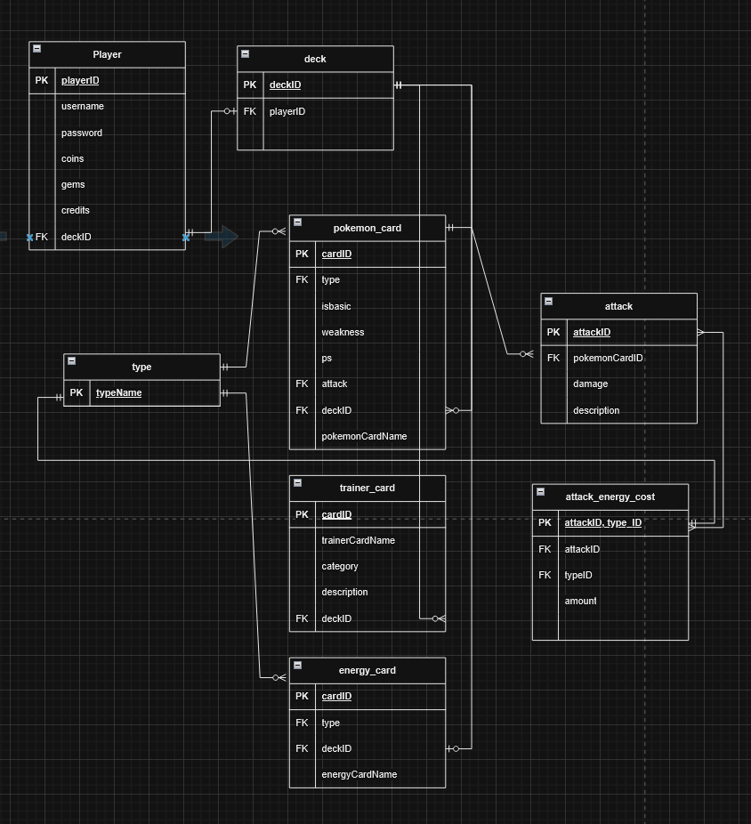

# Pokemon TCG

## Proposed entity relation model of the Pokemon TCG

- **player**

  The player possesses a username and credits in various forms such as coins, gems, etc. A player can have from zero to multiple decks.

- **deck**

  Each deck is identified by a name and may contain different combinations of cards. There are multiple decks.

- **attack**

  Attacks are characterized by damage points, energy requirements, unique IDs, and a description for display on the card. They have a one-to-many relationship with energy requirements as they have varying requirements.

- **attack_energy_cost**

  This table has a composite primary key of the attack and a type, providing the quantity of energy points required for the attack and the required type.

- **trainer_card**

  Trainer cards are identified by their respective ID, the description that appears on the card, and a category which can be an item, tool item, person, or stadium.

- **energy_card**

  Energy cards only possess an ID and type (e.g., water, ground, etc.).

- **type**

  These are types that appear in the game and are applicable to different entities (Pokémon and energy cards), such as electric, fire, etc.

- **pokemon_card**

  This table includes additional attributes. It describes health points, evolution stage (indicating the level of evolution of the Pokémon), a boolean value indicating whether it is "basic," weakness, attacks as foreign keys, type as a foreign key, and an ID.
